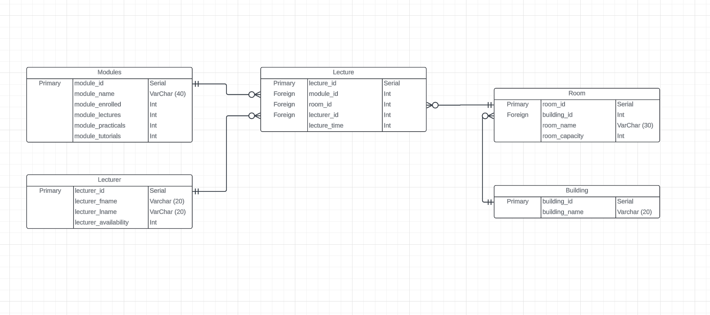

# University Timetable Generator 

The project is designed to generate a university timetable.

## Table Of Contents

1. [Description](#description)
2. [Technologies](#technologies)
3. [Installation](#installation)
4. [Final Steps](#final-setup)
5. [Program Guide](#how-to-use-the-project)
6. [Credits](#credits)

## Description

The project generates a timetable based of data stored in the database and a set of pre-determined conditions. These conditions are used to reflect various scieniros that are condidered when designing a timetable.

The main lanuage of the project is Python along with various libaires. The database is coded using PostgresSQL. 

## Technologies 

The Technologies used in the project:
* [Python](https://docs.python.org/3/): Version 3.12
* [PostgresSQL](https://www.postgresql.org/download/): Version x.xx
* [Psycopg2](https://www.psycopg.org/docs/): Version: 2.9.9
* [Kivy](https://kivy.org/doc/): Version: x.xx

## Installation

The project is built in Python using various libaires as listed above and PostgresSQL.

Below are the steps we would take to install the dependencies.

### Cloning the repository using Git 

Guide to Cloning the repository via [Github Website](https://docs.github.com/en/repositories/creating-and-managing-repositories/cloning-a-repository)

### Python Link and Documentation

These are the links to download Python and the language documentation:

- [Python Download](https://www.python.org/downloads/)
- [Python Documentation](https://docs.python.org/3/)

## The Python libaries used: 

Psycopg2: Used to connect Pytho to a PostgresSQL database and run quiers in Python: [Documentation](https://www.psycopg.org/docs/)

Kivy: Used to create the GUI for the project: [Documentation](https://kivy.org/doc/)

Typing: (Not Required) Used to improve comments and Type Scripting to the program: [Documentation](https://docs.python.org/3/library/typing.html)

### Installation Guide For Python Libaries: 

For installing the various Python Libaries, we recomend using the package manger [pip](https://pypi.org/project/pip/)

* Psycopg2: 2.9.9
'''
pip install psycopg2
''' 

* Kivy: 
'''
pip install kivy
'''

## Installation Guide For PostgresSQL

Download link for PostgreSQL: [PostgresSQL Download](https://www.postgresql.org/download/)

We recommend downloading PostgresSQL locally to your machine as it will make running the program easier, this will also allow you more control and ability to test any changes made to the database. 

### Download Steps

1. Download the correct and most recent download for your OS (Windows, Linux, MacOS, etc...)
2. Once the Postgres has downloaded, navigate to your start / apps section of your computer / laptop / etc and search for __pgAdmin_4__.
3. On your first time openning __pgAdmin_4__ you will need to set a password, rememeber the password, you will need this password for configuration.
4. The setup should now be complete. 

## Final setup 

Once all the dependencies have been downloaded and successfully installed, you will need to complete some further steps before the project can run.

### Final Steps

1. Navigate to the __Config.py__ file / Navigate to the __databaseManager.py__ file
2. You will need to enter the following infomation:
    - host --> The name of the server the database is hosted on.
    - dbname --> The name of the database the data is being stored on.
    - password --> Ypur password, this is the same password you used when first opening __pgAdmin_4__.

3. Save these changes in the file.

After making these changes, the project should run. 

## How to use the Project

This area is used to provide various guides on how to use the timetable generator program as intended and avoid various issues. 

### Navigating the GUI (Graphical User Interface)

This section us used to help users navigate and interact with the GUI.

### Using the Database

This section is used to show the stucture of the database and various use cases on inserting, updating and manipulting data in the database

#### Database ERD

### Generating a Timetable 
### Known Problems 

## Credits

### Group 2D 

* Kieron / up2109872
* bfararjeh / up2157533
*
*
*
*
*
