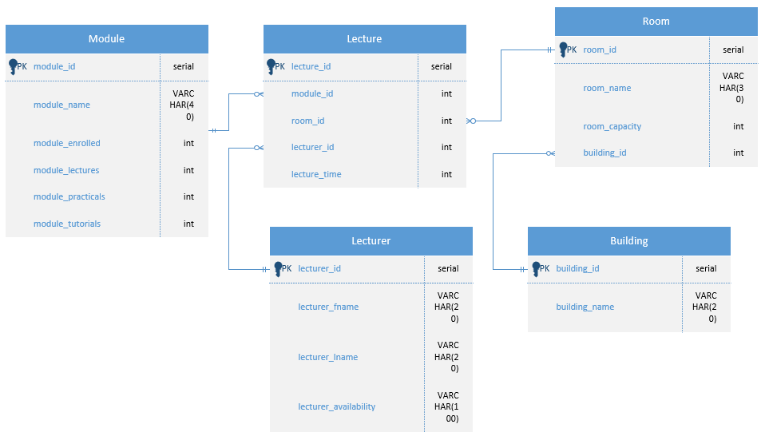

Database
=====
.. _database

Using the Database
~~~~~~~~~~~~~~~~~~
The database is a PostgreSQL DB. The program interacts with the database through the database builder and manger functions, and uses pgAdmin as a connector.
This section is used to show the structure of the database and various use cases on inserting, updating, and manipulating data in the database
The lecture table is initialised as empty without data. On timetable generation from the algorithm it pulls in the relevant module, room and lecturer ids to create the lectures and populate the table. 
The data change functions allow for new data to be inserted into either the module, room, builiding, or lecturers tables. When these functions are used new entries populate the relevant table so they can be used in the timetable generation algorithm.

Database ERD
~~~~~~~~~~~~~

Generating a Timetable
~~~~~~~~~~~~~~~~~~~~~~
The algorithm reads the database to extract the information needed on modules, lecturer and rooms, so they can be processed in generating the lectures which can then populate the lecture table in the DB, creating the timetable.

